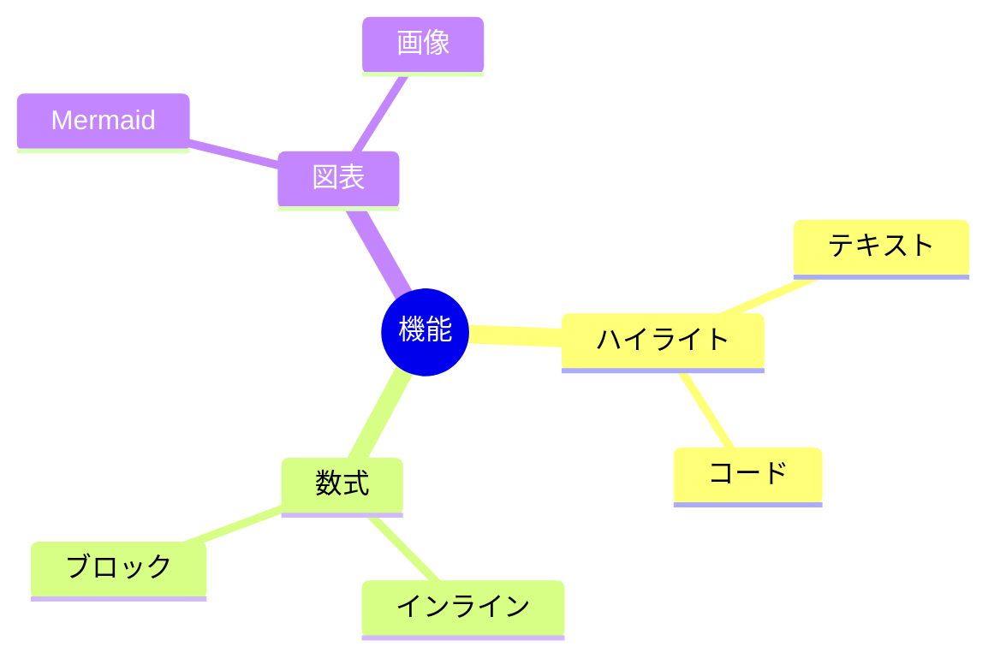

# 包括的機能テスト

## 1. ハイライトテキスト

==これはハイライトされるべきテキストです==

通常のテキストと ==ハイライトテキスト== が混在している場合。

==日本語のハイライト== と ==English highlight== の両方をテスト。

## 2. コードハイライト

### JavaScript
```javascript
function fibonacci(n) {
    if (n <= 1) return n;
    return fibonacci(n - 1) + fibonacci(n - 2);
}
console.log(fibonacci(10));
```

### Python
```python
def hello():
    print("Hello, World!")
```

### 言語指定なし
```
function test() {
    return "no language specified";
}
```

## 3. LaTeX数式

### インライン数式
質量エネルギー等価性: $E = mc^2$

### ディスプレイ数式
$$
\int_{-\infty}^{\infty} e^{-x^2} dx = \sqrt{\pi}
$$

### 複雑な数式
$$
\begin{align}
\nabla \times \vec{\mathbf{B}} -\, \frac1c\, \frac{\partial\vec{\mathbf{E}}}{\partial t} &= \frac{4\pi}{c}\vec{\mathbf{j}} \\
\nabla \cdot \vec{\mathbf{E}} &= 4 \pi \rho
\end{align}
$$

## 4. Mermaidダイアグラム



## 5. 多言語・絵文字テスト

### 中文字符测试
- 简体中文：你好世界！
- 繁体中文：你好世界！

### 表情符号测试 😊
- 基本表情：😀 😃 😄 😁 😆 😅 😂 🤣
- 手势：👍 👎 👌 ✌️ 🤞

## 6. 基本的なMarkdown要素

### リスト
- リスト項目1
- リスト項目2
  - ネストされた項目
  - もう一つのネスト

### 番号付きリスト
1. 最初の項目
2. 二番目の項目
3. 三番目の項目

### テーブル
| 機能 | 対応状況 | 備考 |
|------|----------|------|
| ハイライトテキスト | ✅ | ==テキスト== |
| コードハイライト | ✅ | 複数言語対応 |
| LaTeX数式 | ✅ | KaTeX使用 |
| Mermaid | ✅ | 最新版対応 |

### 引用
> これは引用文です。
> 複数行にわたる引用も可能です。

### 強調
**太字テキスト** と *斜体テキスト* と ~~取り消し線~~

### リンク
[GitHub](https://github.com) へのリンク

### 水平線
---

## 7. 日本語フォント品質

この文書は、改善されたPDF生成品質をテストするためのものです。ひらがな、カタカナ、漢字が適切なフォントで表示され、文字間隔や行間が最適化されているかをチェックします。

### 文字種テスト
- ひらがな：あいうえおかきくけこ
- カタカナ：アイウエオカキクケコ
- 漢字：日本語文字品質確認
- 英数字：ABCDEabcde12345
- 記号：！？。、：；「」（）【】

終わり。
