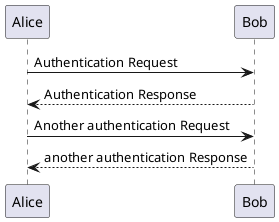
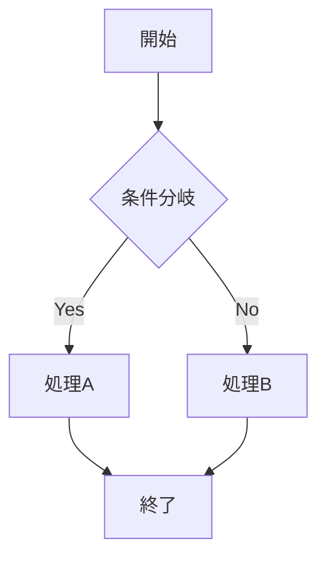
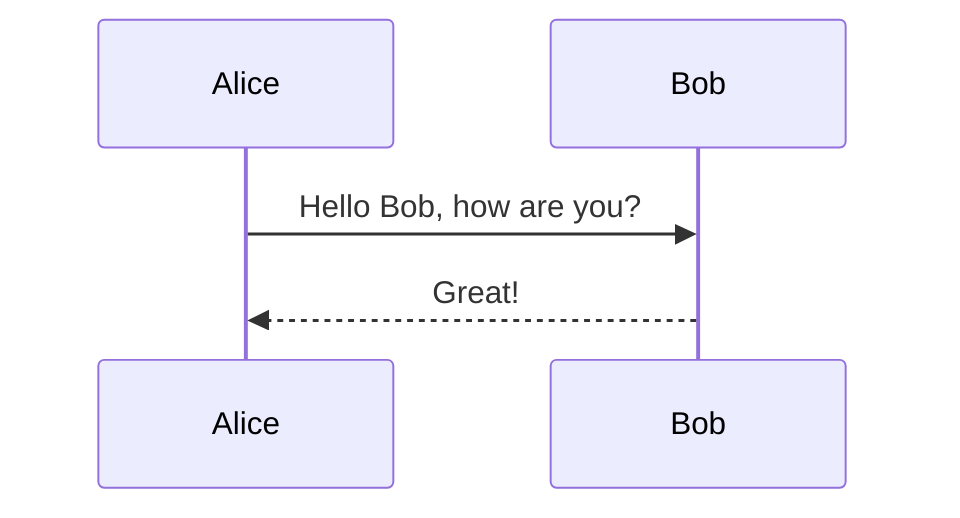
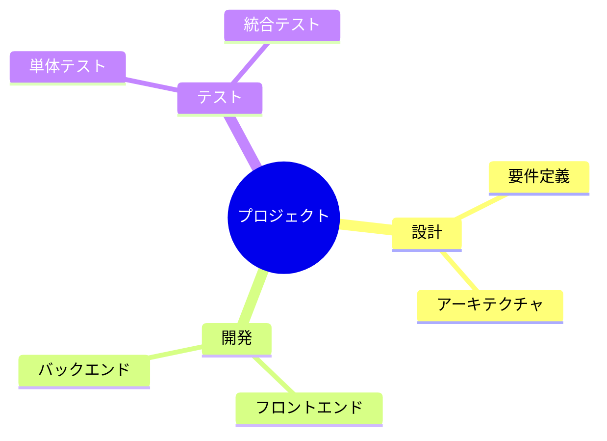

# 機能テスト

## 1. LaTeX数式テスト

### インライン数式
これは $E = mc^2$ のインライン数式です。

### ブロック数式
$$
\int_{-\infty}^{\infty} e^{-x^2} dx = \sqrt{\pi}
$$

### 複雑な数式
$$
\begin{align}
\nabla \times \vec{\mathbf{B}} -\, \frac1c\, \frac{\partial\vec{\mathbf{E}}}{\partial t} &= \frac{4\pi}{c}\vec{\mathbf{j}} \\
\nabla \cdot \vec{\mathbf{E}} &= 4 \pi \rho \\
\nabla \times \vec{\mathbf{E}}\, +\, \frac1c\, \frac{\partial\vec{\mathbf{B}}}{\partial t} &= \vec{\mathbf{0}} \\
\nabla \cdot \vec{\mathbf{B}} &= 0
\end{align}
$$

## 2. PlantUMLテスト

### HTMLタグ形式

### Markdown形式（一部のパーサーで対応）

## 4. Mermaidテスト（対応済み）

### フローチャート

### シーケンス図

### マインドマップ（v11対応）

## 結果予想

- ✅ Mermaid図表: 正常に表示される
- ❌ LaTeX数式: 生のテキストとして表示される
- ❌ PlantUML: コードブロックとして表示される
