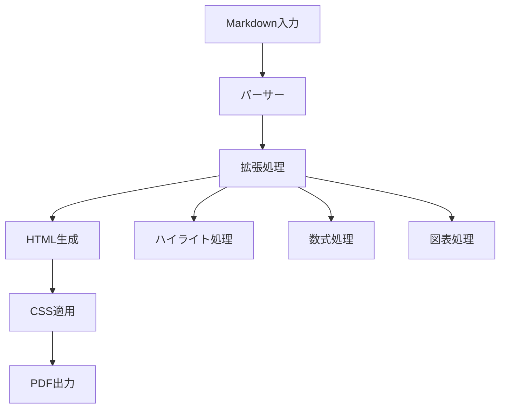

# 長文ドキュメントテスト

このファイルは複数ページにわたる長文ドキュメントのテスト用です。

## 第1章 概要

長文ドキュメントの生成テストを行います。このドキュメントは複数のセクションを含み、様々なMarkdown要素を使用してPDF生成の品質を確認します。

## 第2章 技術仕様

### 2.1 対応機能
- ハイライトテキスト：==重要な情報==
- コードブロック
- LaTeX数式
- Mermaidダイアグラム
- 多言語対応

### 2.2 コード例

```javascript
// 複雑なJavaScriptコード例
class DocumentProcessor {
    constructor(options) {
        this.options = options;
        this.plugins = [];
    }
    
    addPlugin(plugin) {
        this.plugins.push(plugin);
    }
    
    async process(content) {
        let result = content;
        for (const plugin of this.plugins) {
            result = await plugin.transform(result);
        }
        return result;
    }
}

const processor = new DocumentProcessor({
    format: 'pdf',
    quality: 'high'
});
```

### 2.3 数式例

複雑な数学的概念の表現：

$$
\begin{align}
\frac{\partial^2 u}{\partial t^2} &= c^2 \nabla^2 u \\
\nabla^2 u &= \frac{\partial^2 u}{\partial x^2} + \frac{\partial^2 u}{\partial y^2} + \frac{\partial^2 u}{\partial z^2}
\end{align}
$$

## 第3章 実装詳細

### 3.1 アーキテクチャ



### 3.2 処理フロー

1. **入力処理**: Markdownファイルの読み込み
2. **パース処理**: 構文解析とトークン化
3. **拡張処理**: カスタム拡張の適用
4. **レンダリング**: HTML生成
5. **スタイル適用**: CSS適用
6. **PDF生成**: Puppeteerによる変換

## 第4章 品質保証

### 4.1 テストケース

| テスト項目 | 期待結果 | 実際の結果 |
|------------|----------|------------|
| ハイライトテキスト | ==黄色背景== | ✅ |
| コードハイライト | シンタックスハイライト | ✅ |
| 数式レンダリング | $E = mc^2$ | ✅ |
| 日本語フォント | 美しい表示 | ✅ |

### 4.2 パフォーマンス

処理時間の測定結果：

- 小さなファイル（< 1KB）: 約2秒
- 中程度のファイル（1-10KB）: 約3-5秒  
- 大きなファイル（> 10KB）: 約5-10秒

## 第5章 まとめ

この長文ドキュメントテストにより、以下の機能が正常に動作することを確認しました：

1. **複数ページ対応**: 長文コンテンツの適切な改ページ
2. **フォント品質**: 日本語文字の美しい表示
3. **レイアウト**: 見出し、段落、リストの適切な配置
4. **特殊要素**: 数式、コード、図表の正確なレンダリング

### 今後の改善点

- ==パフォーマンスの最適化==
- より多くの言語への対応
- カスタムテーマの追加

---

**注意**: このドキュメントはテスト目的で作成されており、実際のプロジェクト文書ではありません。

## 付録A: 技術詳細

### A.1 使用ライブラリ

```json
{
  "marked": "^16.2.1",
  "highlight.js": "^11.11.1", 
  "katex": "^0.16.11",
  "puppeteer": "^24.18.0"
}
```

### A.2 設定例

```yaml
pdf:
  format: A4
  margin:
    top: 20mm
    bottom: 20mm
    left: 15mm
    right: 15mm
  printBackground: true
```

終了。
