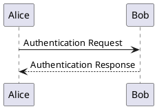
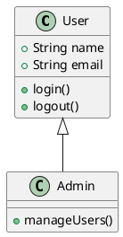

# PlantUMLテスト

## シーケンス図

```plantuml
@startuml
Alice -> Bob: Authentication Request
Bob --> Alice: Authentication Response
@enduml
```

## クラス図

```plantuml
@startuml
class User {
  +String name
  +String email
  +login()
  +logout()
}

class Admin {
  +manageUsers()
}

User <|-- Admin
@enduml
```
