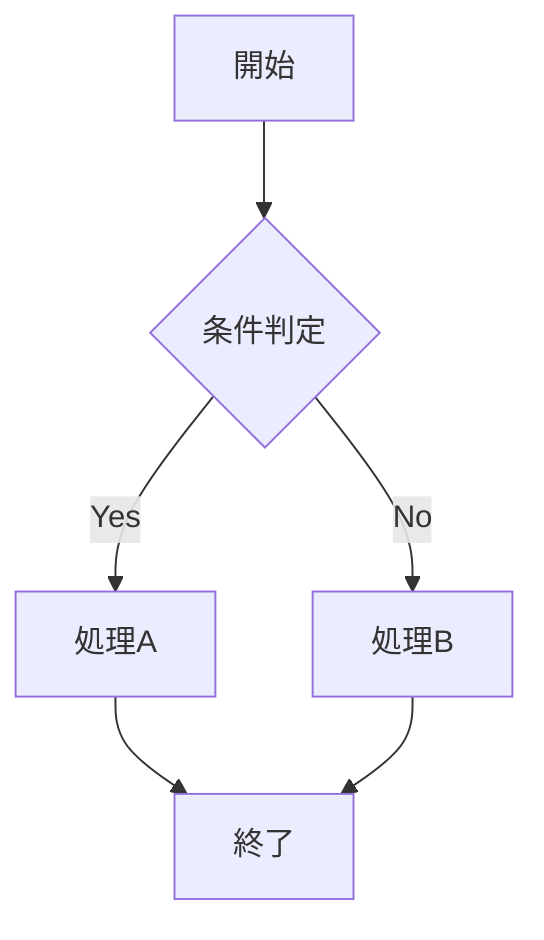
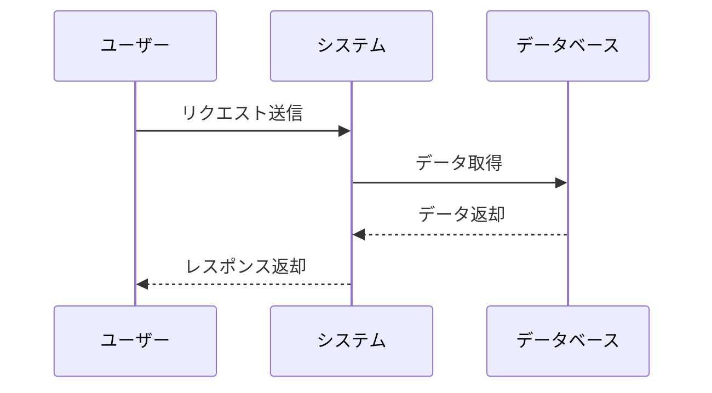

# PDF品質テスト文書

## 日本語フォント品質テスト

この文書は、改善されたPDF生成品質をテストするためのものです。

### 本文テスト
日本語の文章が美しく表示されることを確認します。ひらがな、カタカナ、漢字が適切なフォントで表示され、文字間隔や行間が最適化されているかをチェックします。

### 数式テスト

インライン数式: $E = mc^2$

ディスプレイ数式:
$$\int_{-\infty}^{\infty} e^{-x^2} dx = \sqrt{\pi}$$

複雑な数式:
$$\begin{pmatrix}
a & b \\
c & d
\end{pmatrix} \begin{pmatrix}
x \\
y
\end{pmatrix} = \begin{pmatrix}
ax + by \\
cx + dy
\end{pmatrix}$$

### コードブロックテスト

```javascript
// JetBrains Monoフォントでのコード表示テスト
function calculateSum(a, b) {
    return a + b;
}

const result = calculateSum(10, 20);
console.log(`結果: ${result}`);
```

```python
# Pythonコードの表示テスト
def fibonacci(n):
    if n <= 1:
        return n
    return fibonacci(n-1) + fibonacci(n-2)

# フィボナッチ数列の計算
for i in range(10):
    print(f"F({i}) = {fibonacci(i)}")
```

### Mermaidダイアグラムテスト





### 表テスト

| 項目 | 値 | 説明 |
|------|-----|------|
| フォント | Noto Sans JP | 高品質な日本語フォント |
| レンダリング | アンチエイリアス | 滑らかな文字表示 |
| DPI | 192dpi | 高解像度対応 |

### 引用テスト

> 美しいタイポグラフィは、読者の体験を向上させる重要な要素です。
> 適切なフォント選択と設定により、文書の可読性と美しさが大幅に改善されます。

### リストテスト

1. **高品質フォント**
   - Noto Sans JP（本文）
   - Noto Serif JP（見出し）
   - JetBrains Mono（コード）

2. **レンダリング最適化**
   - アンチエイリアシング
   - サブピクセルレンダリング
   - リガチャサポート

3. **多言語対応**
   - 日本語: ひらがな、カタカナ、漢字
   - 中国語: 简体中文、繁體中文
   - 韓国語: 한국어

---

この文書により、フォント品質、数式レンダリング、コードハイライト、図表表示の改善を確認できます。
