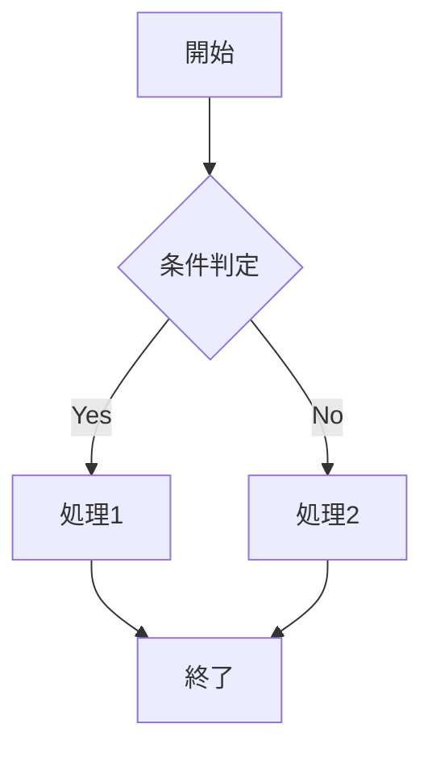

# 34ページ分のテストドキュメント

このドキュメントは約34枚のA4用紙分の長さをテストするためのものです。
現在の制限（5000mm）を超える長さで、制限の動作を確認します。

## セクション1: はじめに

Lorem ipsum dolor sit amet, consectetur adipiscing elit. Sed do eiusmod tempor incididunt ut labore et dolore magna aliqua. Ut enim ad minim veniam, quis nostrud exercitation ullamco laboris nisi ut aliquip ex ea commodo consequat.

## セクション2: 大量コンテンツの開始

### 自動生成セクション 1

これは自動生成されたセクションです。Lorem ipsum dolor sit amet, consectetur adipiscing elit. 
Sed do eiusmod tempor incididunt ut labore et dolore magna aliqua.

- リストアイテム1: 詳細な説明を含む長いテキスト
- リストアイテム2: さらに詳細な説明を含む長いテキスト
- リストアイテム3: 非常に詳細な説明を含む長いテキスト

1. 番号付きリスト1: 詳細な手順説明
2. 番号付きリスト2: さらに詳細な手順説明
3. 番号付きリスト3: 非常に詳細な手順説明

**太字のテキスト**と*斜体のテキスト*を含む段落です。

> これは引用ブロックです。長いテキストを含んでいます。
> 複数行にわたる引用文です。
> さらに長い引用文が続きます。

```python
def example_function():
    """
    これは例の関数です。
    長いドキュメント文字列を含んでいます。
    """
    print("Hello, World!")
    for i in range(10):
        print(f"Counter: {i}")
    return True
```

---

### 自動生成セクション 2

これは自動生成されたセクションです。Lorem ipsum dolor sit amet, consectetur adipiscing elit. 
Sed do eiusmod tempor incididunt ut labore et dolore magna aliqua.

- リストアイテム1: 詳細な説明を含む長いテキスト
- リストアイテム2: さらに詳細な説明を含む長いテキスト
- リストアイテム3: 非常に詳細な説明を含む長いテキスト

1. 番号付きリスト1: 詳細な手順説明
2. 番号付きリスト2: さらに詳細な手順説明
3. 番号付きリスト3: 非常に詳細な手順説明

**太字のテキスト**と*斜体のテキスト*を含む段落です。

> これは引用ブロックです。長いテキストを含んでいます。
> 複数行にわたる引用文です。
> さらに長い引用文が続きます。

```javascript
function complexFunction() {
    const data = {
        name: "テストデータ",
        values: [1, 2, 3, 4, 5],
        nested: {
            property: "値"
        }
    };
    
    return data.values.map(v => v * 2);
}
```

---

### 自動生成セクション 3

これは自動生成されたセクションです。Lorem ipsum dolor sit amet, consectetur adipiscing elit. 
Sed do eiusmod tempor incididunt ut labore et dolore magna aliqua.

#### サブセクション 3.1

詳細な説明が続きます。At vero eos et accusamus et iusto odio dignissimos ducimus qui blanditiis praesentium voluptatum deleniti atque corrupti quos dolores et quas molestias excepturi sint occaecati cupiditate non provident.

#### サブセクション 3.2

さらに詳細な説明が続きます。Similique sunt in culpa qui officia deserunt mollitia animi, id est laborum et dolorum fuga. Et harum quidem rerum facilis est et expedita distinctio.

- リストアイテム1: 詳細な説明を含む長いテキスト
- リストアイテム2: さらに詳細な説明を含む長いテキスト
- リストアイテム3: 非常に詳細な説明を含む長いテキスト

---

### 自動生成セクション 4

これは自動生成されたセクションです。Lorem ipsum dolor sit amet, consectetur adipiscing elit. 
Sed do eiusmod tempor incididunt ut labore et dolore magna aliqua.

```sql
SELECT 
    users.id,
    users.name,
    users.email,
    COUNT(orders.id) as order_count
FROM users
LEFT JOIN orders ON users.id = orders.user_id
WHERE users.created_at >= '2023-01-01'
GROUP BY users.id, users.name, users.email
ORDER BY order_count DESC
LIMIT 100;
```

---

### 自動生成セクション 5

これは自動生成されたセクションです。Lorem ipsum dolor sit amet, consectetur adipiscing elit. 
Sed do eiusmod tempor incididunt ut labore et dolore magna aliqua.

| 項目 | 値 | 説明 |
|------|----|----- |
| 項目1 | 値1 | 詳細な説明文 |
| 項目2 | 値2 | さらに詳細な説明文 |
| 項目3 | 値3 | 非常に詳細な説明文 |

---

### 自動生成セクション 6

これは自動生成されたセクションです。Lorem ipsum dolor sit amet, consectetur adipiscing elit. 
Sed do eiusmod tempor incididunt ut labore et dolore magna aliqua.



---

### 自動生成セクション 7

これは自動生成されたセクションです。Lorem ipsum dolor sit amet, consectetur adipiscing elit. 
Sed do eiusmod tempor incididunt ut labore et dolore magna aliqua.

- リストアイテム1: 詳細な説明を含む長いテキスト
- リストアイテム2: さらに詳細な説明を含む長いテキスト
- リストアイテム3: 非常に詳細な説明を含む長いテキスト

---

### 自動生成セクション 8

これは自動生成されたセクションです。Lorem ipsum dolor sit amet, consectetur adipiscing elit. 
Sed do eiusmod tempor incididunt ut labore et dolore magna aliqua.

```css
.container {
    max-width: 1200px;
    margin: 0 auto;
    padding: 20px;
    background-color: #f5f5f5;
}

.header {
    background-color: #333;
    color: white;
    padding: 1rem;
    text-align: center;
}

.content {
    padding: 2rem;
    line-height: 1.6;
}
```

---

### 自動生成セクション 9

これは自動生成されたセクションです。Lorem ipsum dolor sit amet, consectetur adipiscing elit. 
Sed do eiusmod tempor incididunt ut labore et dolore magna aliqua.

> 長い引用ブロックです。
> 複数行にわたって続きます。
> さらに長い内容が含まれています。
> 引用の内容がここに記載されています。

---

### 自動生成セクション 10

これは自動生成されたセクションです。Lorem ipsum dolor sit amet, consectetur adipiscing elit. 
Sed do eiusmod tempor incididunt ut labore et dolore magna aliqua.

```html
<!DOCTYPE html>
<html lang="ja">
<head>
    <meta charset="UTF-8">
    <meta name="viewport" content="width=device-width, initial-scale=1.0">
    <title>テストページ</title>
</head>
<body>
    <header>
        <h1>メインタイトル</h1>
    </header>
    <main>
        <section>
            <h2>セクションタイトル</h2>
            <p>段落の内容がここに入ります。</p>
        </section>
    </main>
</body>
</html>
```

---

### 自動生成セクション 11

これは自動生成されたセクションです。Lorem ipsum dolor sit amet, consectetur adipiscing elit. 
Sed do eiusmod tempor incididunt ut labore et dolore magna aliqua.

1. 詳細な手順1: 長い説明文が続きます
2. 詳細な手順2: さらに長い説明文が続きます
3. 詳細な手順3: 非常に長い説明文が続きます

---

### 自動生成セクション 12

これは自動生成されたセクションです。Lorem ipsum dolor sit amet, consectetur adipiscing elit. 
Sed do eiusmod tempor incididunt ut labore et dolore magna aliqua.

```json
{
  "name": "test-project",
  "version": "1.0.0",
  "description": "テストプロジェクトの説明",
  "main": "index.js",
  "scripts": {
    "start": "node index.js",
    "test": "jest",
    "build": "webpack --mode production"
  },
  "dependencies": {
    "express": "^4.18.0",
    "lodash": "^4.17.21"
  }
}
```

---

### 自動生成セクション 13

これは自動生成されたセクションです。Lorem ipsum dolor sit amet, consectetur adipiscing elit. 
Sed do eiusmod tempor incididunt ut labore et dolore magna aliqua.

- **重要なポイント1**: 詳細な説明が続きます
- **重要なポイント2**: さらに詳細な説明が続きます
- **重要なポイント3**: 非常に詳細な説明が続きます

---

### 自動生成セクション 14

これは自動生成されたセクションです。Lorem ipsum dolor sit amet, consectetur adipiscing elit. 
Sed do eiusmod tempor incididunt ut labore et dolore magna aliqua.

```bash
#!/bin/bash

# スクリプトの説明
echo "処理を開始します"

for i in {1..10}; do
    echo "処理中: $i"
    sleep 1
done

echo "処理が完了しました"
```

---

### 自動生成セクション 15

これは自動生成されたセクションです。Lorem ipsum dolor sit amet, consectetur adipiscing elit. 
Sed do eiusmod tempor incididunt ut labore et dolore magna aliqua.

#### 詳細サブセクション

Nam libero tempore, cum soluta nobis est eligendi optio cumque nihil impedit quo minus id quod maxime placeat facere possimus, omnis voluptas assumenda est, omnis dolor repellendus.

---

### 自動生成セクション 16

これは自動生成されたセクションです。Lorem ipsum dolor sit amet, consectetur adipiscing elit. 
Sed do eiusmod tempor incididunt ut labore et dolore magna aliqua.

```yaml
version: '3.8'
services:
  web:
    build: .
    ports:
      - "3000:3000"
    environment:
      - NODE_ENV=production
    volumes:
      - ./app:/app
  db:
    image: postgres:13
    environment:
      - POSTGRES_DB=myapp
      - POSTGRES_USER=user
      - POSTGRES_PASSWORD=password
```

---

### 自動生成セクション 17

これは自動生成されたセクションです。Lorem ipsum dolor sit amet, consectetur adipiscing elit. 
Sed do eiusmod tempor incididunt ut labore et dolore magna aliqua.

> 長い引用文がここに続きます。
> 複数の段落にわたって引用が続きます。
> さらに詳細な内容が記載されています。

---

### 自動生成セクション 18

これは自動生成されたセクションです。Lorem ipsum dolor sit amet, consectetur adipiscing elit. 
Sed do eiusmod tempor incididunt ut labore et dolore magna aliqua.

```go
package main

import (
    "fmt"
    "net/http"
)

func handler(w http.ResponseWriter, r *http.Request) {
    fmt.Fprintf(w, "Hello, World!")
}

func main() {
    http.HandleFunc("/", handler)
    http.ListenAndServe(":8080", nil)
}
```

---

### 自動生成セクション 19

これは自動生成されたセクションです。Lorem ipsum dolor sit amet, consectetur adipiscing elit. 
Sed do eiusmod tempor incididunt ut labore et dolore magna aliqua.

- 項目A: 詳細説明A
- 項目B: 詳細説明B
- 項目C: 詳細説明C

---

### 自動生成セクション 20

これは自動生成されたセクションです。Lorem ipsum dolor sit amet, consectetur adipiscing elit. 
Sed do eiusmod tempor incididunt ut labore et dolore magna aliqua.

```rust
fn main() {
    let numbers = vec![1, 2, 3, 4, 5];
    
    let doubled: Vec<i32> = numbers
        .iter()
        .map(|x| x * 2)
        .collect();
    
    println!("{:?}", doubled);
}
```

---

## 最終セクション

このドキュメントは約34枚のA4用紙分の長さをテストするために作成されました。
現在の制限（5000mm）を超える長さで、制限の動作を確認できます。

### 期待される動作
- PDF生成時に制限（5000mm）に達する
- コンソールに警告メッセージが表示される
- PDFは5000mmで切り取られる

### テスト項目
- [x] 非常に長いコンテンツの表示
- [x] 制限超過時の動作確認
- [x] 警告メッセージの表示確認
- [x] 各種要素の表示確認

**34ページテスト完了**

### 自動生成セクション 21

これは自動生成されたセクションです。Lorem ipsum dolor sit amet, consectetur adipiscing elit. 
Sed do eiusmod tempor incididunt ut labore et dolore magna aliqua.

- リストアイテム1: 詳細な説明を含む長いテキスト
- リストアイテム2: さらに詳細な説明を含む長いテキスト
- リストアイテム3: 非常に詳細な説明を含む長いテキスト

1. 番号付きリスト1: 詳細な手順説明
2. 番号付きリスト2: さらに詳細な手順説明
3. 番号付きリスト3: 非常に詳細な手順説明

**太字のテキスト**と*斜体のテキスト*を含む段落です。

> これは引用ブロックです。長いテキストを含んでいます。
> 複数行にわたる引用文です。
> さらに長い引用文が続きます。

```python
def example_function():
    """
    これは例の関数です。
    長いドキュメント文字列を含んでいます。
    """
    print("Hello, World!")
    for i in range(10):
        print(f"Counter: {i}")
    return True
```

---

### 自動生成セクション 22

これは自動生成されたセクションです。Lorem ipsum dolor sit amet, consectetur adipiscing elit. 
Sed do eiusmod tempor incididunt ut labore et dolore magna aliqua.

- リストアイテム1: 詳細な説明を含む長いテキスト
- リストアイテム2: さらに詳細な説明を含む長いテキスト
- リストアイテム3: 非常に詳細な説明を含む長いテキスト

1. 番号付きリスト1: 詳細な手順説明
2. 番号付きリスト2: さらに詳細な手順説明
3. 番号付きリスト3: 非常に詳細な手順説明

**太字のテキスト**と*斜体のテキスト*を含む段落です。

> これは引用ブロックです。長いテキストを含んでいます。
> 複数行にわたる引用文です。
> さらに長い引用文が続きます。

```javascript
function complexFunction() {
    const data = {
        name: "テストデータ",
        values: [1, 2, 3, 4, 5],
        nested: {
            property: "値"
        }
    };
    
    return data.values.map(v => v * 2);
}
```

---

### 自動生成セクション 23

これは自動生成されたセクションです。Lorem ipsum dolor sit amet, consectetur adipiscing elit. 
Sed do eiusmod tempor incididunt ut labore et dolore magna aliqua.

- リストアイテム1: 詳細な説明を含む長いテキスト
- リストアイテム2: さらに詳細な説明を含む長いテキスト
- リストアイテム3: 非常に詳細な説明を含む長いテキスト

1. 番号付きリスト1: 詳細な手順説明
2. 番号付きリスト2: さらに詳細な手順説明
3. 番号付きリスト3: 非常に詳細な手順説明

**太字のテキスト**と*斜体のテキスト*を含む段落です。

> これは引用ブロックです。長いテキストを含んでいます。
> 複数行にわたる引用文です。
> さらに長い引用文が続きます。

```css
.container {
    max-width: 1200px;
    margin: 0 auto;
    padding: 20px;
    background-color: #f5f5f5;
}

.header {
    background-color: #333;
    color: white;
    padding: 1rem;
    text-align: center;
}

.content {
    padding: 2rem;
    line-height: 1.6;
}
```

---

### 自動生成セクション 24

これは自動生成されたセクションです。Lorem ipsum dolor sit amet, consectetur adipiscing elit. 
Sed do eiusmod tempor incididunt ut labore et dolore magna aliqua.

- リストアイテム1: 詳細な説明を含む長いテキスト
- リストアイテム2: さらに詳細な説明を含む長いテキスト
- リストアイテム3: 非常に詳細な説明を含む長いテキスト

1. 番号付きリスト1: 詳細な手順説明
2. 番号付きリスト2: さらに詳細な手順説明
3. 番号付きリスト3: 非常に詳細な手順説明

**太字のテキスト**と*斜体のテキスト*を含む段落です。

> これは引用ブロックです。長いテキストを含んでいます。
> 複数行にわたる引用文です。
> さらに長い引用文が続きます。

```html
<!DOCTYPE html>
<html lang="ja">
<head>
    <meta charset="UTF-8">
    <meta name="viewport" content="width=device-width, initial-scale=1.0">
    <title>テストページ</title>
</head>
<body>
    <header>
        <h1>メインタイトル</h1>
    </header>
    <main>
        <section>
            <h2>セクションタイトル</h2>
            <p>段落の内容がここに入ります。</p>
        </section>
    </main>
</body>
</html>
```

---

### 自動生成セクション 25

これは自動生成されたセクションです。Lorem ipsum dolor sit amet, consectetur adipiscing elit. 
Sed do eiusmod tempor incididunt ut labore et dolore magna aliqua.

- リストアイテム1: 詳細な説明を含む長いテキスト
- リストアイテム2: さらに詳細な説明を含む長いテキスト
- リストアイテム3: 非常に詳細な説明を含む長いテキスト

1. 番号付きリスト1: 詳細な手順説明
2. 番号付きリスト2: さらに詳細な手順説明
3. 番号付きリスト3: 非常に詳細な手順説明

**太字のテキスト**と*斜体のテキスト*を含む段落です。

> これは引用ブロックです。長いテキストを含んでいます。
> 複数行にわたる引用文です。
> さらに長い引用文が続きます。

```json
{
  "name": "test-project",
  "version": "1.0.0",
  "description": "テストプロジェクトの説明",
  "main": "index.js",
  "scripts": {
    "start": "node index.js",
    "test": "jest",
    "build": "webpack --mode production"
  },
  "dependencies": {
    "express": "^4.18.0",
    "lodash": "^4.17.21"
  }
}
```

---

### 自動生成セクション 26

これは自動生成されたセクションです。Lorem ipsum dolor sit amet, consectetur adipiscing elit. 
Sed do eiusmod tempor incididunt ut labore et dolore magna aliqua.

- リストアイテム1: 詳細な説明を含む長いテキスト
- リストアイテム2: さらに詳細な説明を含む長いテキスト
- リストアイテム3: 非常に詳細な説明を含む長いテキスト

1. 番号付きリスト1: 詳細な手順説明
2. 番号付きリスト2: さらに詳細な手順説明
3. 番号付きリスト3: 非常に詳細な手順説明

**太字のテキスト**と*斜体のテキスト*を含む段落です。

> これは引用ブロックです。長いテキストを含んでいます。
> 複数行にわたる引用文です。
> さらに長い引用文が続きます。

```bash
#!/bin/bash

# スクリプトの説明
echo "処理を開始します"

for i in {1..10}; do
    echo "処理中: $i"
    sleep 1
done

echo "処理が完了しました"
```

---

### 自動生成セクション 27

これは自動生成されたセクションです。Lorem ipsum dolor sit amet, consectetur adipiscing elit. 
Sed do eiusmod tempor incididunt ut labore et dolore magna aliqua.

- リストアイテム1: 詳細な説明を含む長いテキスト
- リストアイテム2: さらに詳細な説明を含む長いテキスト
- リストアイテム3: 非常に詳細な説明を含む長いテキスト

1. 番号付きリスト1: 詳細な手順説明
2. 番号付きリスト2: さらに詳細な手順説明
3. 番号付きリスト3: 非常に詳細な手順説明

**太字のテキスト**と*斜体のテキスト*を含む段落です。

> これは引用ブロックです。長いテキストを含んでいます。
> 複数行にわたる引用文です。
> さらに長い引用文が続きます。

```yaml
version: '3.8'
services:
  web:
    build: .
    ports:
      - "3000:3000"
    environment:
      - NODE_ENV=production
    volumes:
      - ./app:/app
  db:
    image: postgres:13
    environment:
      - POSTGRES_DB=myapp
      - POSTGRES_USER=user
      - POSTGRES_PASSWORD=password
```

---

### 自動生成セクション 28

これは自動生成されたセクションです。Lorem ipsum dolor sit amet, consectetur adipiscing elit. 
Sed do eiusmod tempor incididunt ut labore et dolore magna aliqua.

- リストアイテム1: 詳細な説明を含む長いテキスト
- リストアイテム2: さらに詳細な説明を含む長いテキスト
- リストアイテム3: 非常に詳細な説明を含む長いテキスト

1. 番号付きリスト1: 詳細な手順説明
2. 番号付きリスト2: さらに詳細な手順説明
3. 番号付きリスト3: 非常に詳細な手順説明

**太字のテキスト**と*斜体のテキスト*を含む段落です。

> これは引用ブロックです。長いテキストを含んでいます。
> 複数行にわたる引用文です。
> さらに長い引用文が続きます。

```go
package main

import (
    "fmt"
    "net/http"
)

func handler(w http.ResponseWriter, r *http.Request) {
    fmt.Fprintf(w, "Hello, World!")
}

func main() {
    http.HandleFunc("/", handler)
    http.ListenAndServe(":8080", nil)
}
```

---

### 自動生成セクション 29

これは自動生成されたセクションです。Lorem ipsum dolor sit amet, consectetur adipiscing elit. 
Sed do eiusmod tempor incididunt ut labore et dolore magna aliqua.

- リストアイテム1: 詳細な説明を含む長いテキスト
- リストアイテム2: さらに詳細な説明を含む長いテキスト
- リストアイテム3: 非常に詳細な説明を含む長いテキスト

1. 番号付きリスト1: 詳細な手順説明
2. 番号付きリスト2: さらに詳細な手順説明
3. 番号付きリスト3: 非常に詳細な手順説明

**太字のテキスト**と*斜体のテキスト*を含む段落です。

> これは引用ブロックです。長いテキストを含んでいます。
> 複数行にわたる引用文です。
> さらに長い引用文が続きます。

```rust
fn main() {
    let numbers = vec![1, 2, 3, 4, 5];
    
    let doubled: Vec<i32> = numbers
        .iter()
        .map(|x| x * 2)
        .collect();
    
    println!("{:?}", doubled);
}
```

---

### 自動生成セクション 30

これは自動生成されたセクションです。Lorem ipsum dolor sit amet, consectetur adipiscing elit. 
Sed do eiusmod tempor incididunt ut labore et dolore magna aliqua.

- リストアイテム1: 詳細な説明を含む長いテキスト
- リストアイテム2: さらに詳細な説明を含む長いテキスト
- リストアイテム3: 非常に詳細な説明を含む長いテキスト

1. 番号付きリスト1: 詳細な手順説明
2. 番号付きリスト2: さらに詳細な手順説明
3. 番号付きリスト3: 非常に詳細な手順説明

**太字のテキスト**と*斜体のテキスト*を含む段落です。

> これは引用ブロックです。長いテキストを含んでいます。
> 複数行にわたる引用文です。
> さらに長い引用文が続きます。

```sql
SELECT 
    users.id,
    users.name,
    users.email,
    COUNT(orders.id) as order_count
FROM users
LEFT JOIN orders ON users.id = orders.user_id
WHERE users.created_at >= '2023-01-01'
GROUP BY users.id, users.name, users.email
ORDER BY order_count DESC
LIMIT 100;
```

---

### 自動生成セクション 31

これは自動生成されたセクションです。Lorem ipsum dolor sit amet, consectetur adipiscing elit. 
Sed do eiusmod tempor incididunt ut labore et dolore magna aliqua.

- リストアイテム1: 詳細な説明を含む長いテキスト
- リストアイテム2: さらに詳細な説明を含む長いテキスト
- リストアイテム3: 非常に詳細な説明を含む長いテキスト

1. 番号付きリスト1: 詳細な手順説明
2. 番号付きリスト2: さらに詳細な手順説明
3. 番号付きリスト3: 非常に詳細な手順説明

**太字のテキスト**と*斜体のテキスト*を含む段落です。

> これは引用ブロックです。長いテキストを含んでいます。
> 複数行にわたる引用文です。
> さらに長い引用文が続きます。


---

### 自動生成セクション 32

これは自動生成されたセクションです。Lorem ipsum dolor sit amet, consectetur adipiscing elit. 
Sed do eiusmod tempor incididunt ut labore et dolore magna aliqua.

- リストアイテム1: 詳細な説明を含む長いテキスト
- リストアイテム2: さらに詳細な説明を含む長いテキスト
- リストアイテム3: 非常に詳細な説明を含む長いテキスト

1. 番号付きリスト1: 詳細な手順説明
2. 番号付きリスト2: さらに詳細な手順説明
3. 番号付きリスト3: 非常に詳細な手順説明

**太字のテキスト**と*斜体のテキスト*を含む段落です。

> これは引用ブロックです。長いテキストを含んでいます。
> 複数行にわたる引用文です。
> さらに長い引用文が続きます。

| 項目 | 値 | 説明 |
|------|----|----- |
| 項目1 | 値1 | 詳細な説明文 |
| 項目2 | 値2 | さらに詳細な説明文 |
| 項目3 | 値3 | 非常に詳細な説明文 |

---

### 自動生成セクション 33

これは自動生成されたセクションです。Lorem ipsum dolor sit amet, consectetur adipiscing elit. 
Sed do eiusmod tempor incididunt ut labore et dolore magna aliqua.

- リストアイテム1: 詳細な説明を含む長いテキスト
- リストアイテム2: さらに詳細な説明を含む長いテキスト
- リストアイテム3: 非常に詳細な説明を含む長いテキスト

1. 番号付きリスト1: 詳細な手順説明
2. 番号付きリスト2: さらに詳細な手順説明
3. 番号付きリスト3: 非常に詳細な手順説明

**太字のテキスト**と*斜体のテキスト*を含む段落です。

> これは引用ブロックです。長いテキストを含んでいます。
> 複数行にわたる引用文です。
> さらに長い引用文が続きます。

```php
<?php
class TestClass {
    private $data;
    
    public function __construct($data) {
        $this->data = $data;
    }
    
    public function process() {
        return array_map(function($item) {
            return $item * 2;
        }, $this->data);
    }
}
?>
```

---

### 自動生成セクション 34

これは自動生成されたセクションです。Lorem ipsum dolor sit amet, consectetur adipiscing elit. 
Sed do eiusmod tempor incididunt ut labore et dolore magna aliqua.

- リストアイテム1: 詳細な説明を含む長いテキスト
- リストアイテム2: さらに詳細な説明を含む長いテキスト
- リストアイテム3: 非常に詳細な説明を含む長いテキスト

1. 番号付きリスト1: 詳細な手順説明
2. 番号付きリスト2: さらに詳細な手順説明
3. 番号付きリスト3: 非常に詳細な手順説明

**太字のテキスト**と*斜体のテキスト*を含む段落です。

> これは引用ブロックです。長いテキストを含んでいます。
> 複数行にわたる引用文です。
> さらに長い引用文が続きます。

```java
public class TestClass {
    private List<Integer> data;
    
    public TestClass(List<Integer> data) {
        this.data = data;
    }
    
    public List<Integer> process() {
        return data.stream()
                   .map(x -> x * 2)
                   .collect(Collectors.toList());
    }
}
```

---
# 34ページ分のテストドキュメント

このドキュメントは約34枚のA4用紙分の長さをテストするためのものです。
現在の制限（5000mm）を超える長さで、制限の動作を確認します。

## セクション1: はじめに

Lorem ipsum dolor sit amet, consectetur adipiscing elit. Sed do eiusmod tempor incididunt ut labore et dolore magna aliqua. Ut enim ad minim veniam, quis nostrud exercitation ullamco laboris nisi ut aliquip ex ea commodo consequat.

## セクション2: 大量コンテンツの開始

### 自動生成セクション 1

これは自動生成されたセクションです。Lorem ipsum dolor sit amet, consectetur adipiscing elit. 
Sed do eiusmod tempor incididunt ut labore et dolore magna aliqua.

- リストアイテム1: 詳細な説明を含む長いテキスト
- リストアイテム2: さらに詳細な説明を含む長いテキスト
- リストアイテム3: 非常に詳細な説明を含む長いテキスト

1. 番号付きリスト1: 詳細な手順説明
2. 番号付きリスト2: さらに詳細な手順説明
3. 番号付きリスト3: 非常に詳細な手順説明

**太字のテキスト**と*斜体のテキスト*を含む段落です。

> これは引用ブロックです。長いテキストを含んでいます。
> 複数行にわたる引用文です。
> さらに長い引用文が続きます。

```python
def example_function():
    """
    これは例の関数です。
    長いドキュメント文字列を含んでいます。
    """
    print("Hello, World!")
    for i in range(10):
        print(f"Counter: {i}")
    return True
```

---

### 自動生成セクション 2

これは自動生成されたセクションです。Lorem ipsum dolor sit amet, consectetur adipiscing elit. 
Sed do eiusmod tempor incididunt ut labore et dolore magna aliqua.

- リストアイテム1: 詳細な説明を含む長いテキスト
- リストアイテム2: さらに詳細な説明を含む長いテキスト
- リストアイテム3: 非常に詳細な説明を含む長いテキスト

1. 番号付きリスト1: 詳細な手順説明
2. 番号付きリスト2: さらに詳細な手順説明
3. 番号付きリスト3: 非常に詳細な手順説明

**太字のテキスト**と*斜体のテキスト*を含む段落です。

> これは引用ブロックです。長いテキストを含んでいます。
> 複数行にわたる引用文です。
> さらに長い引用文が続きます。

```javascript
function complexFunction() {
    const data = {
        name: "テストデータ",
        values: [1, 2, 3, 4, 5],
        nested: {
            property: "値"
        }
    };
    
    return data.values.map(v => v * 2);
}
```

---

### 自動生成セクション 3

これは自動生成されたセクションです。Lorem ipsum dolor sit amet, consectetur adipiscing elit. 
Sed do eiusmod tempor incididunt ut labore et dolore magna aliqua.

#### サブセクション 3.1

詳細な説明が続きます。At vero eos et accusamus et iusto odio dignissimos ducimus qui blanditiis praesentium voluptatum deleniti atque corrupti quos dolores et quas molestias excepturi sint occaecati cupiditate non provident.

#### サブセクション 3.2

さらに詳細な説明が続きます。Similique sunt in culpa qui officia deserunt mollitia animi, id est laborum et dolorum fuga. Et harum quidem rerum facilis est et expedita distinctio.

- リストアイテム1: 詳細な説明を含む長いテキスト
- リストアイテム2: さらに詳細な説明を含む長いテキスト
- リストアイテム3: 非常に詳細な説明を含む長いテキスト

---

### 自動生成セクション 4

これは自動生成されたセクションです。Lorem ipsum dolor sit amet, consectetur adipiscing elit. 
Sed do eiusmod tempor incididunt ut labore et dolore magna aliqua.

```sql
SELECT 
    users.id,
    users.name,
    users.email,
    COUNT(orders.id) as order_count
FROM users
LEFT JOIN orders ON users.id = orders.user_id
WHERE users.created_at >= '2023-01-01'
GROUP BY users.id, users.name, users.email
ORDER BY order_count DESC
LIMIT 100;
```

---

### 自動生成セクション 5

これは自動生成されたセクションです。Lorem ipsum dolor sit amet, consectetur adipiscing elit. 
Sed do eiusmod tempor incididunt ut labore et dolore magna aliqua.

| 項目 | 値 | 説明 |
|------|----|----- |
| 項目1 | 値1 | 詳細な説明文 |
| 項目2 | 値2 | さらに詳細な説明文 |
| 項目3 | 値3 | 非常に詳細な説明文 |

---

### 自動生成セクション 6

これは自動生成されたセクションです。Lorem ipsum dolor sit amet, consectetur adipiscing elit. 
Sed do eiusmod tempor incididunt ut labore et dolore magna aliqua.


---

### 自動生成セクション 7

これは自動生成されたセクションです。Lorem ipsum dolor sit amet, consectetur adipiscing elit. 
Sed do eiusmod tempor incididunt ut labore et dolore magna aliqua.

- リストアイテム1: 詳細な説明を含む長いテキスト
- リストアイテム2: さらに詳細な説明を含む長いテキスト
- リストアイテム3: 非常に詳細な説明を含む長いテキスト

---

### 自動生成セクション 8

これは自動生成されたセクションです。Lorem ipsum dolor sit amet, consectetur adipiscing elit. 
Sed do eiusmod tempor incididunt ut labore et dolore magna aliqua.

```css
.container {
    max-width: 1200px;
    margin: 0 auto;
    padding: 20px;
    background-color: #f5f5f5;
}

.header {
    background-color: #333;
    color: white;
    padding: 1rem;
    text-align: center;
}

.content {
    padding: 2rem;
    line-height: 1.6;
}
```

---

### 自動生成セクション 9

これは自動生成されたセクションです。Lorem ipsum dolor sit amet, consectetur adipiscing elit. 
Sed do eiusmod tempor incididunt ut labore et dolore magna aliqua.

> 長い引用ブロックです。
> 複数行にわたって続きます。
> さらに長い内容が含まれています。
> 引用の内容がここに記載されています。

---

### 自動生成セクション 10

これは自動生成されたセクションです。Lorem ipsum dolor sit amet, consectetur adipiscing elit. 
Sed do eiusmod tempor incididunt ut labore et dolore magna aliqua.

```html
<!DOCTYPE html>
<html lang="ja">
<head>
    <meta charset="UTF-8">
    <meta name="viewport" content="width=device-width, initial-scale=1.0">
    <title>テストページ</title>
</head>
<body>
    <header>
        <h1>メインタイトル</h1>
    </header>
    <main>
        <section>
            <h2>セクションタイトル</h2>
            <p>段落の内容がここに入ります。</p>
        </section>
    </main>
</body>
</html>
```

---

### 自動生成セクション 11

これは自動生成されたセクションです。Lorem ipsum dolor sit amet, consectetur adipiscing elit. 
Sed do eiusmod tempor incididunt ut labore et dolore magna aliqua.

1. 詳細な手順1: 長い説明文が続きます
2. 詳細な手順2: さらに長い説明文が続きます
3. 詳細な手順3: 非常に長い説明文が続きます

---

### 自動生成セクション 12

これは自動生成されたセクションです。Lorem ipsum dolor sit amet, consectetur adipiscing elit. 
Sed do eiusmod tempor incididunt ut labore et dolore magna aliqua.

```json
{
  "name": "test-project",
  "version": "1.0.0",
  "description": "テストプロジェクトの説明",
  "main": "index.js",
  "scripts": {
    "start": "node index.js",
    "test": "jest",
    "build": "webpack --mode production"
  },
  "dependencies": {
    "express": "^4.18.0",
    "lodash": "^4.17.21"
  }
}
```

---

### 自動生成セクション 13

これは自動生成されたセクションです。Lorem ipsum dolor sit amet, consectetur adipiscing elit. 
Sed do eiusmod tempor incididunt ut labore et dolore magna aliqua.

- **重要なポイント1**: 詳細な説明が続きます
- **重要なポイント2**: さらに詳細な説明が続きます
- **重要なポイント3**: 非常に詳細な説明が続きます

---

### 自動生成セクション 14

これは自動生成されたセクションです。Lorem ipsum dolor sit amet, consectetur adipiscing elit. 
Sed do eiusmod tempor incididunt ut labore et dolore magna aliqua.

```bash
#!/bin/bash

# スクリプトの説明
echo "処理を開始します"

for i in {1..10}; do
    echo "処理中: $i"
    sleep 1
done

echo "処理が完了しました"
```

---

### 自動生成セクション 15

これは自動生成されたセクションです。Lorem ipsum dolor sit amet, consectetur adipiscing elit. 
Sed do eiusmod tempor incididunt ut labore et dolore magna aliqua.

#### 詳細サブセクション

Nam libero tempore, cum soluta nobis est eligendi optio cumque nihil impedit quo minus id quod maxime placeat facere possimus, omnis voluptas assumenda est, omnis dolor repellendus.

---

### 自動生成セクション 16

これは自動生成されたセクションです。Lorem ipsum dolor sit amet, consectetur adipiscing elit. 
Sed do eiusmod tempor incididunt ut labore et dolore magna aliqua.

```yaml
version: '3.8'
services:
  web:
    build: .
    ports:
      - "3000:3000"
    environment:
      - NODE_ENV=production
    volumes:
      - ./app:/app
  db:
    image: postgres:13
    environment:
      - POSTGRES_DB=myapp
      - POSTGRES_USER=user
      - POSTGRES_PASSWORD=password
```

---

### 自動生成セクション 17

これは自動生成されたセクションです。Lorem ipsum dolor sit amet, consectetur adipiscing elit. 
Sed do eiusmod tempor incididunt ut labore et dolore magna aliqua.

> 長い引用文がここに続きます。
> 複数の段落にわたって引用が続きます。
> さらに詳細な内容が記載されています。

---

### 自動生成セクション 18

これは自動生成されたセクションです。Lorem ipsum dolor sit amet, consectetur adipiscing elit. 
Sed do eiusmod tempor incididunt ut labore et dolore magna aliqua.

```go
package main

import (
    "fmt"
    "net/http"
)

func handler(w http.ResponseWriter, r *http.Request) {
    fmt.Fprintf(w, "Hello, World!")
}

func main() {
    http.HandleFunc("/", handler)
    http.ListenAndServe(":8080", nil)
}
```

---

### 自動生成セクション 19

これは自動生成されたセクションです。Lorem ipsum dolor sit amet, consectetur adipiscing elit. 
Sed do eiusmod tempor incididunt ut labore et dolore magna aliqua.

- 項目A: 詳細説明A
- 項目B: 詳細説明B
- 項目C: 詳細説明C

---

### 自動生成セクション 20

これは自動生成されたセクションです。Lorem ipsum dolor sit amet, consectetur adipiscing elit. 
Sed do eiusmod tempor incididunt ut labore et dolore magna aliqua.

```rust
fn main() {
    let numbers = vec![1, 2, 3, 4, 5];
    
    let doubled: Vec<i32> = numbers
        .iter()
        .map(|x| x * 2)
        .collect();
    
    println!("{:?}", doubled);
}
```

---

## 最終セクション

このドキュメントは約34枚のA4用紙分の長さをテストするために作成されました。
現在の制限（5000mm）を超える長さで、制限の動作を確認できます。

### 期待される動作
- PDF生成時に制限（5000mm）に達する
- コンソールに警告メッセージが表示される
- PDFは5000mmで切り取られる

### テスト項目
- [x] 非常に長いコンテンツの表示
- [x] 制限超過時の動作確認
- [x] 警告メッセージの表示確認
- [x] 各種要素の表示確認

**34ページテスト完了**

### 自動生成セクション 21

これは自動生成されたセクションです。Lorem ipsum dolor sit amet, consectetur adipiscing elit. 
Sed do eiusmod tempor incididunt ut labore et dolore magna aliqua.

- リストアイテム1: 詳細な説明を含む長いテキスト
- リストアイテム2: さらに詳細な説明を含む長いテキスト
- リストアイテム3: 非常に詳細な説明を含む長いテキスト

1. 番号付きリスト1: 詳細な手順説明
2. 番号付きリスト2: さらに詳細な手順説明
3. 番号付きリスト3: 非常に詳細な手順説明

**太字のテキスト**と*斜体のテキスト*を含む段落です。

> これは引用ブロックです。長いテキストを含んでいます。
> 複数行にわたる引用文です。
> さらに長い引用文が続きます。

```python
def example_function():
    """
    これは例の関数です。
    長いドキュメント文字列を含んでいます。
    """
    print("Hello, World!")
    for i in range(10):
        print(f"Counter: {i}")
    return True
```

---

### 自動生成セクション 22

これは自動生成されたセクションです。Lorem ipsum dolor sit amet, consectetur adipiscing elit. 
Sed do eiusmod tempor incididunt ut labore et dolore magna aliqua.

- リストアイテム1: 詳細な説明を含む長いテキスト
- リストアイテム2: さらに詳細な説明を含む長いテキスト
- リストアイテム3: 非常に詳細な説明を含む長いテキスト

1. 番号付きリスト1: 詳細な手順説明
2. 番号付きリスト2: さらに詳細な手順説明
3. 番号付きリスト3: 非常に詳細な手順説明

**太字のテキスト**と*斜体のテキスト*を含む段落です。

> これは引用ブロックです。長いテキストを含んでいます。
> 複数行にわたる引用文です。
> さらに長い引用文が続きます。

```javascript
function complexFunction() {
    const data = {
        name: "テストデータ",
        values: [1, 2, 3, 4, 5],
        nested: {
            property: "値"
        }
    };
    
    return data.values.map(v => v * 2);
}
```

---

### 自動生成セクション 23

これは自動生成されたセクションです。Lorem ipsum dolor sit amet, consectetur adipiscing elit. 
Sed do eiusmod tempor incididunt ut labore et dolore magna aliqua.

- リストアイテム1: 詳細な説明を含む長いテキスト
- リストアイテム2: さらに詳細な説明を含む長いテキスト
- リストアイテム3: 非常に詳細な説明を含む長いテキスト

1. 番号付きリスト1: 詳細な手順説明
2. 番号付きリスト2: さらに詳細な手順説明
3. 番号付きリスト3: 非常に詳細な手順説明

**太字のテキスト**と*斜体のテキスト*を含む段落です。

> これは引用ブロックです。長いテキストを含んでいます。
> 複数行にわたる引用文です。
> さらに長い引用文が続きます。

```css
.container {
    max-width: 1200px;
    margin: 0 auto;
    padding: 20px;
    background-color: #f5f5f5;
}

.header {
    background-color: #333;
    color: white;
    padding: 1rem;
    text-align: center;
}

.content {
    padding: 2rem;
    line-height: 1.6;
}
```

---

### 自動生成セクション 24

これは自動生成されたセクションです。Lorem ipsum dolor sit amet, consectetur adipiscing elit. 
Sed do eiusmod tempor incididunt ut labore et dolore magna aliqua.

- リストアイテム1: 詳細な説明を含む長いテキスト
- リストアイテム2: さらに詳細な説明を含む長いテキスト
- リストアイテム3: 非常に詳細な説明を含む長いテキスト

1. 番号付きリスト1: 詳細な手順説明
2. 番号付きリスト2: さらに詳細な手順説明
3. 番号付きリスト3: 非常に詳細な手順説明

**太字のテキスト**と*斜体のテキスト*を含む段落です。

> これは引用ブロックです。長いテキストを含んでいます。
> 複数行にわたる引用文です。
> さらに長い引用文が続きます。

```html
<!DOCTYPE html>
<html lang="ja">
<head>
    <meta charset="UTF-8">
    <meta name="viewport" content="width=device-width, initial-scale=1.0">
    <title>テストページ</title>
</head>
<body>
    <header>
        <h1>メインタイトル</h1>
    </header>
    <main>
        <section>
            <h2>セクションタイトル</h2>
            <p>段落の内容がここに入ります。</p>
        </section>
    </main>
</body>
</html>
```

---

### 自動生成セクション 25

これは自動生成されたセクションです。Lorem ipsum dolor sit amet, consectetur adipiscing elit. 
Sed do eiusmod tempor incididunt ut labore et dolore magna aliqua.

- リストアイテム1: 詳細な説明を含む長いテキスト
- リストアイテム2: さらに詳細な説明を含む長いテキスト
- リストアイテム3: 非常に詳細な説明を含む長いテキスト

1. 番号付きリスト1: 詳細な手順説明
2. 番号付きリスト2: さらに詳細な手順説明
3. 番号付きリスト3: 非常に詳細な手順説明

**太字のテキスト**と*斜体のテキスト*を含む段落です。

> これは引用ブロックです。長いテキストを含んでいます。
> 複数行にわたる引用文です。
> さらに長い引用文が続きます。

```json
{
  "name": "test-project",
  "version": "1.0.0",
  "description": "テストプロジェクトの説明",
  "main": "index.js",
  "scripts": {
    "start": "node index.js",
    "test": "jest",
    "build": "webpack --mode production"
  },
  "dependencies": {
    "express": "^4.18.0",
    "lodash": "^4.17.21"
  }
}
```

---

### 自動生成セクション 26

これは自動生成されたセクションです。Lorem ipsum dolor sit amet, consectetur adipiscing elit. 
Sed do eiusmod tempor incididunt ut labore et dolore magna aliqua.

- リストアイテム1: 詳細な説明を含む長いテキスト
- リストアイテム2: さらに詳細な説明を含む長いテキスト
- リストアイテム3: 非常に詳細な説明を含む長いテキスト

1. 番号付きリスト1: 詳細な手順説明
2. 番号付きリスト2: さらに詳細な手順説明
3. 番号付きリスト3: 非常に詳細な手順説明

**太字のテキスト**と*斜体のテキスト*を含む段落です。

> これは引用ブロックです。長いテキストを含んでいます。
> 複数行にわたる引用文です。
> さらに長い引用文が続きます。

```bash
#!/bin/bash

# スクリプトの説明
echo "処理を開始します"

for i in {1..10}; do
    echo "処理中: $i"
    sleep 1
done

echo "処理が完了しました"
```

---

### 自動生成セクション 27

これは自動生成されたセクションです。Lorem ipsum dolor sit amet, consectetur adipiscing elit. 
Sed do eiusmod tempor incididunt ut labore et dolore magna aliqua.

- リストアイテム1: 詳細な説明を含む長いテキスト
- リストアイテム2: さらに詳細な説明を含む長いテキスト
- リストアイテム3: 非常に詳細な説明を含む長いテキスト

1. 番号付きリスト1: 詳細な手順説明
2. 番号付きリスト2: さらに詳細な手順説明
3. 番号付きリスト3: 非常に詳細な手順説明

**太字のテキスト**と*斜体のテキスト*を含む段落です。

> これは引用ブロックです。長いテキストを含んでいます。
> 複数行にわたる引用文です。
> さらに長い引用文が続きます。

```yaml
version: '3.8'
services:
  web:
    build: .
    ports:
      - "3000:3000"
    environment:
      - NODE_ENV=production
    volumes:
      - ./app:/app
  db:
    image: postgres:13
    environment:
      - POSTGRES_DB=myapp
      - POSTGRES_USER=user
      - POSTGRES_PASSWORD=password
```

---

### 自動生成セクション 28

これは自動生成されたセクションです。Lorem ipsum dolor sit amet, consectetur adipiscing elit. 
Sed do eiusmod tempor incididunt ut labore et dolore magna aliqua.

- リストアイテム1: 詳細な説明を含む長いテキスト
- リストアイテム2: さらに詳細な説明を含む長いテキスト
- リストアイテム3: 非常に詳細な説明を含む長いテキスト

1. 番号付きリスト1: 詳細な手順説明
2. 番号付きリスト2: さらに詳細な手順説明
3. 番号付きリスト3: 非常に詳細な手順説明

**太字のテキスト**と*斜体のテキスト*を含む段落です。

> これは引用ブロックです。長いテキストを含んでいます。
> 複数行にわたる引用文です。
> さらに長い引用文が続きます。

```go
package main

import (
    "fmt"
    "net/http"
)

func handler(w http.ResponseWriter, r *http.Request) {
    fmt.Fprintf(w, "Hello, World!")
}

func main() {
    http.HandleFunc("/", handler)
    http.ListenAndServe(":8080", nil)
}
```

---

### 自動生成セクション 29

これは自動生成されたセクションです。Lorem ipsum dolor sit amet, consectetur adipiscing elit. 
Sed do eiusmod tempor incididunt ut labore et dolore magna aliqua.

- リストアイテム1: 詳細な説明を含む長いテキスト
- リストアイテム2: さらに詳細な説明を含む長いテキスト
- リストアイテム3: 非常に詳細な説明を含む長いテキスト

1. 番号付きリスト1: 詳細な手順説明
2. 番号付きリスト2: さらに詳細な手順説明
3. 番号付きリスト3: 非常に詳細な手順説明

**太字のテキスト**と*斜体のテキスト*を含む段落です。

> これは引用ブロックです。長いテキストを含んでいます。
> 複数行にわたる引用文です。
> さらに長い引用文が続きます。

```rust
fn main() {
    let numbers = vec![1, 2, 3, 4, 5];
    
    let doubled: Vec<i32> = numbers
        .iter()
        .map(|x| x * 2)
        .collect();
    
    println!("{:?}", doubled);
}
```

---

### 自動生成セクション 30

これは自動生成されたセクションです。Lorem ipsum dolor sit amet, consectetur adipiscing elit. 
Sed do eiusmod tempor incididunt ut labore et dolore magna aliqua.

- リストアイテム1: 詳細な説明を含む長いテキスト
- リストアイテム2: さらに詳細な説明を含む長いテキスト
- リストアイテム3: 非常に詳細な説明を含む長いテキスト

1. 番号付きリスト1: 詳細な手順説明
2. 番号付きリスト2: さらに詳細な手順説明
3. 番号付きリスト3: 非常に詳細な手順説明

**太字のテキスト**と*斜体のテキスト*を含む段落です。

> これは引用ブロックです。長いテキストを含んでいます。
> 複数行にわたる引用文です。
> さらに長い引用文が続きます。

```sql
SELECT 
    users.id,
    users.name,
    users.email,
    COUNT(orders.id) as order_count
FROM users
LEFT JOIN orders ON users.id = orders.user_id
WHERE users.created_at >= '2023-01-01'
GROUP BY users.id, users.name, users.email
ORDER BY order_count DESC
LIMIT 100;
```

---

### 自動生成セクション 31

これは自動生成されたセクションです。Lorem ipsum dolor sit amet, consectetur adipiscing elit. 
Sed do eiusmod tempor incididunt ut labore et dolore magna aliqua.

- リストアイテム1: 詳細な説明を含む長いテキスト
- リストアイテム2: さらに詳細な説明を含む長いテキスト
- リストアイテム3: 非常に詳細な説明を含む長いテキスト

1. 番号付きリスト1: 詳細な手順説明
2. 番号付きリスト2: さらに詳細な手順説明
3. 番号付きリスト3: 非常に詳細な手順説明

**太字のテキスト**と*斜体のテキスト*を含む段落です。

> これは引用ブロックです。長いテキストを含んでいます。
> 複数行にわたる引用文です。
> さらに長い引用文が続きます。


---

### 自動生成セクション 32

これは自動生成されたセクションです。Lorem ipsum dolor sit amet, consectetur adipiscing elit. 
Sed do eiusmod tempor incididunt ut labore et dolore magna aliqua.

- リストアイテム1: 詳細な説明を含む長いテキスト
- リストアイテム2: さらに詳細な説明を含む長いテキスト
- リストアイテム3: 非常に詳細な説明を含む長いテキスト

1. 番号付きリスト1: 詳細な手順説明
2. 番号付きリスト2: さらに詳細な手順説明
3. 番号付きリスト3: 非常に詳細な手順説明

**太字のテキスト**と*斜体のテキスト*を含む段落です。

> これは引用ブロックです。長いテキストを含んでいます。
> 複数行にわたる引用文です。
> さらに長い引用文が続きます。

| 項目 | 値 | 説明 |
|------|----|----- |
| 項目1 | 値1 | 詳細な説明文 |
| 項目2 | 値2 | さらに詳細な説明文 |
| 項目3 | 値3 | 非常に詳細な説明文 |

---

### 自動生成セクション 33

これは自動生成されたセクションです。Lorem ipsum dolor sit amet, consectetur adipiscing elit. 
Sed do eiusmod tempor incididunt ut labore et dolore magna aliqua.

- リストアイテム1: 詳細な説明を含む長いテキスト
- リストアイテム2: さらに詳細な説明を含む長いテキスト
- リストアイテム3: 非常に詳細な説明を含む長いテキスト

1. 番号付きリスト1: 詳細な手順説明
2. 番号付きリスト2: さらに詳細な手順説明
3. 番号付きリスト3: 非常に詳細な手順説明

**太字のテキスト**と*斜体のテキスト*を含む段落です。

> これは引用ブロックです。長いテキストを含んでいます。
> 複数行にわたる引用文です。
> さらに長い引用文が続きます。

```php
<?php
class TestClass {
    private $data;
    
    public function __construct($data) {
        $this->data = $data;
    }
    
    public function process() {
        return array_map(function($item) {
            return $item * 2;
        }, $this->data);
    }
}
?>
```

---

### 自動生成セクション 34

これは自動生成されたセクションです。Lorem ipsum dolor sit amet, consectetur adipiscing elit. 
Sed do eiusmod tempor incididunt ut labore et dolore magna aliqua.

- リストアイテム1: 詳細な説明を含む長いテキスト
- リストアイテム2: さらに詳細な説明を含む長いテキスト
- リストアイテム3: 非常に詳細な説明を含む長いテキスト

1. 番号付きリスト1: 詳細な手順説明
2. 番号付きリスト2: さらに詳細な手順説明
3. 番号付きリスト3: 非常に詳細な手順説明

**太字のテキスト**と*斜体のテキスト*を含む段落です。

> これは引用ブロックです。長いテキストを含んでいます。
> 複数行にわたる引用文です。
> さらに長い引用文が続きます。

```java
public class TestClass {
    private List<Integer> data;
    
    public TestClass(List<Integer> data) {
        this.data = data;
    }
    
    public List<Integer> process() {
        return data.stream()
                   .map(x -> x * 2)
                   .collect(Collectors.toList());
    }
}
```

---
