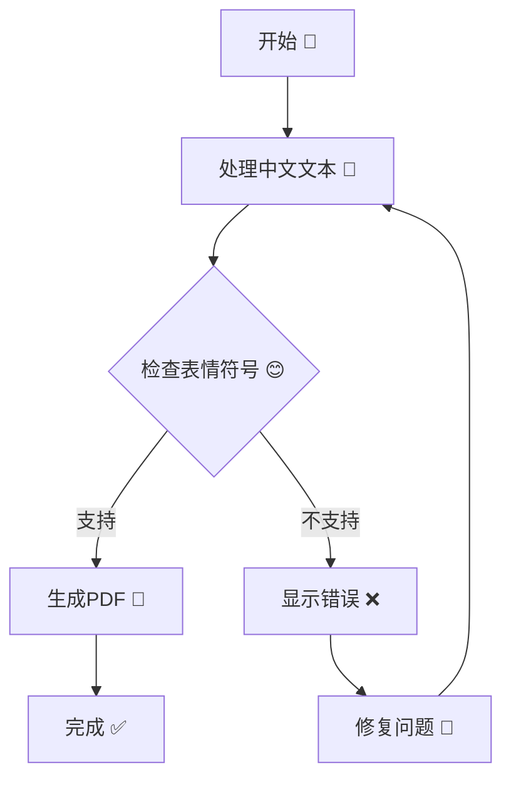
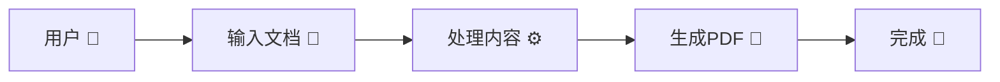
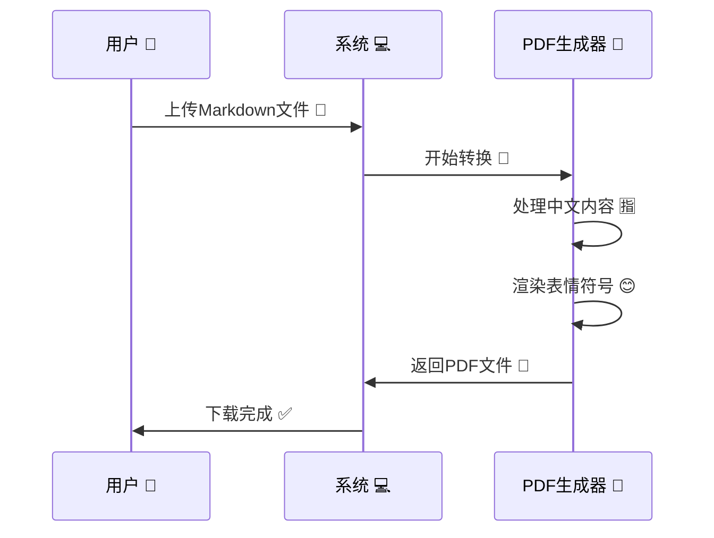

# 测试文档 📝

这是一个简体中文和表情符号测试文档。

## 功能测试 🚀

### 中文字符测试
- 简体中文：你好世界！
- 繁体中文：你好世界！
- 数字：一二三四五六七八九十
- 标点符号：，。！？；：""''（）【】

### 表情符号测试 😊
- 基本表情：😀 😃 😄 😁 😆 😅 😂 🤣
- 手势：👍 👎 👌 ✌️ 🤞 🤟 🤘 🤙
- 物品：📱 💻 🖥️ ⌨️ 🖱️ 🖨️ 📷 📹
- 符号：✅ ❌ ⭐ 🔥 💡 🎯 🚀 📊

### Mermaid图表测试 📊



### 流程图测试



### 序列图测试



## 特殊字符测试

### 中文标点符号
- 句号：。
- 逗号：，
- 问号：？
- 感叹号：！
- 冒号：：
- 分号：；
- 引号：""''
- 括号：（）【】

### Unicode字符
- 货币符号：¥ $ € £
- 数学符号：± × ÷ ≈ ≠ ≤ ≥
- 箭头符号：← → ↑ ↓ ↔ ↕

## 代码块测试

```python
# 中文注释测试
def hello_world():
    print("你好，世界！🌍")
    return "测试成功 ✅"

# 表情符号在代码中
emoji_list = ["😀", "😃", "😄", "😁"]
```

```javascript
// JavaScript中文注释
function greetInChinese() {
    console.log("你好！👋");
    return "欢迎使用 🎉";
}
```

## 表格测试

| 项目 | 状态 | 备注 |
|------|------|------|
| 中文显示 | ✅ | 正常 |
| 表情符号 | 😊 | 测试中 |
| Mermaid图表 | 📊 | 支持 |
| PDF生成 | 🚀 | 进行中 |

## 总结

这个测试文档包含了：
1. 简体中文字符 🈯
2. 各种表情符号 😊
3. Mermaid图表与中文标签 📊
4. 代码块中的中文注释 💻
5. 表格中的中文内容 📋

如果PDF能够正确显示所有内容，说明扩展程序完全支持中文和表情符号！🎉
