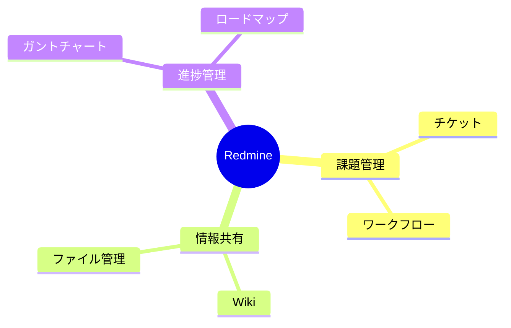
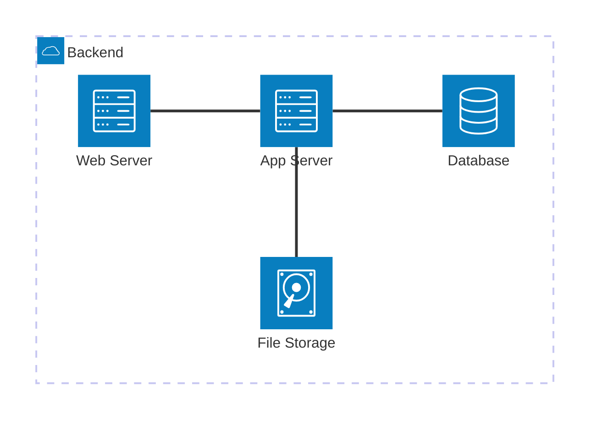
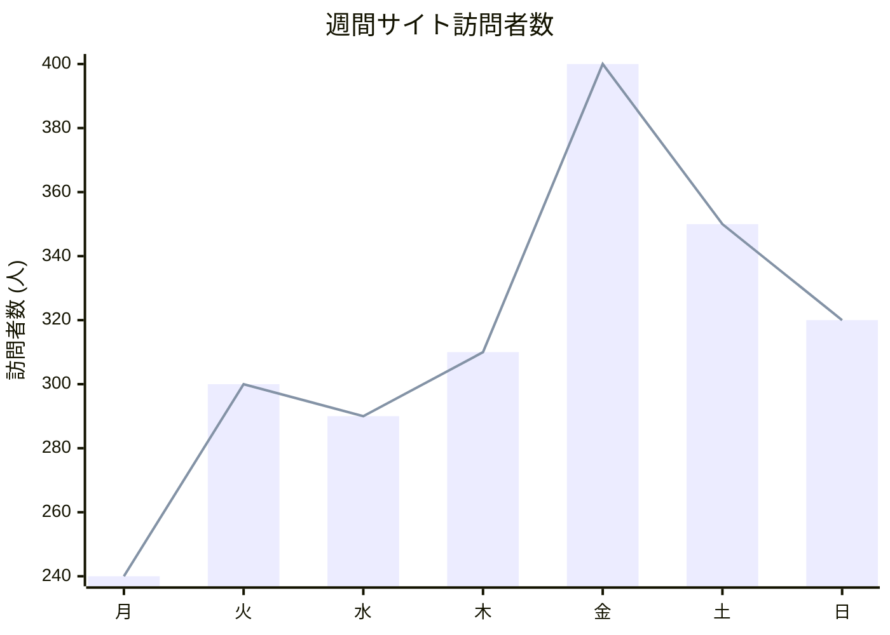

```mermaid
flowchart LR
  N1@{ img: "https://cdn.qiita.com/assets/favicons/public/production-c620d3e403342b1022967ba5e3db1aaa.ico", w: 60, h: 60, constraint: "on" }

  subgraph GC[AWS Cloud]
    N2@{ img: "https://api.iconify.design/logos/aws-elb.svg", label: "ELB", pos: "t", w: 60, h: 60, constraint: "on" }
    N3@{ img: "https://api.iconify.design/logos/aws-ecs.svg", label: "ECS", pos: "t", w: 60, h: 60, constraint: "on" }
    N4@{ img: "https://api.iconify.design/logos/aws-iam.svg", label: "IAM", pos: "t", w: 60, h: 60, constraint: "on" }
  end

  N1 --- N2 --- N3 ~~~ N4

  style GC fill:none,color:#345,stroke:#345
```

https://qiita.com/b-mente/items/89e900dab7319ef502be

```mermaid
architecture-beta
    group api(logos:aws-lambda)[API]

    service db(logos:aws-aurora)[Database] in api
    service disk1(logos:aws-glacier)[Storage] in api
    service disk2(logos:aws-s3)[Storage] in api
    service server(logos:aws-ec2)[Server] in api

    db:L -- R:server
    disk1:T -- B:server
    disk2:T -- B:db
```


