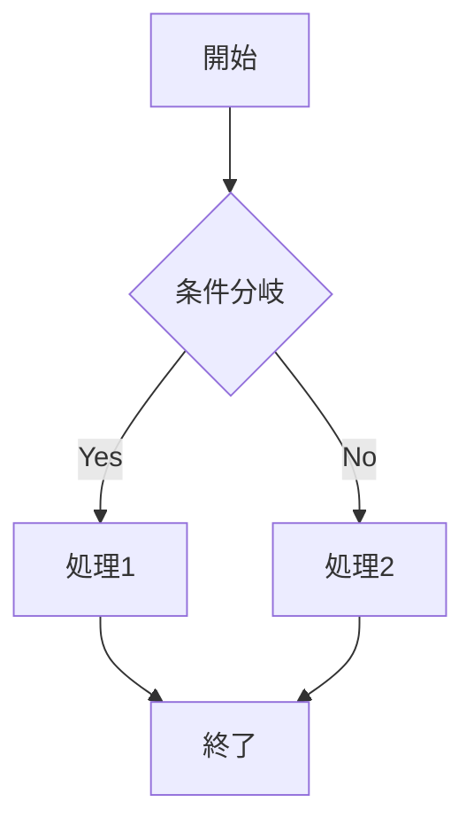

# 1ページPDFテスト

このファイルは1ページPDF機能をテストするためのサンプルです。

## 概要

通常のPDF変換では複数ページに分かれる可能性がありますが、1ページPDF機能では全てのコンテンツが1つのページに収まるように用紙サイズが自動調整されます。

## Mermaid図表のテスト



## コードブロック

```javascript
function convertToPdf(markdown, options) {
    const config = {
        onePage: true,
        margin: {
            top: '10mm',
            right: '10mm',
            bottom: '10mm',
            left: '10mm'
        }
    };
    
    return generatePdf(markdown, config);
}
```

## リスト

### 機能一覧
- 通常のPDF変換（既存機能）
- 1ページPDF変換（新機能）
- Mermaid図表対応
- 日本語・中国語・絵文字対応
- 狭い余白設定

### 利点
1. **閲覧性向上**: 全体を一目で確認可能
2. **印刷不要**: デジタル閲覧に最適化
3. **共有しやすい**: 1つのファイルで完結

## 表

| 機能 | 通常PDF | 1ページPDF |
|------|---------|------------|
| ページ数 | 複数 | 1ページ |
| 用紙サイズ | A4固定 | 動的調整 |
| 余白 | 標準 | 狭い |
| 用途 | 印刷・閲覧 | 閲覧専用 |

## 長いテキストの例

Lorem ipsum dolor sit amet, consectetur adipiscing elit. Sed do eiusmod tempor incididunt ut labore et dolore magna aliqua. Ut enim ad minim veniam, quis nostrud exercitation ullamco laboris nisi ut aliquip ex ea commodo consequat. Duis aute irure dolor in reprehenderit in voluptate velit esse cillum dolore eu fugiat nulla pariatur.

Excepteur sint occaecat cupidatat non proident, sunt in culpa qui officia deserunt mollit anim id est laborum. Sed ut perspiciatis unde omnis iste natus error sit voluptatem accusantium doloremque laudantium.

## 引用

> 「1ページPDF機能により、Markdownドキュメントの閲覧体験が大幅に向上します。特に、全体の構造を把握したい場合や、デジタルデバイスでの閲覧に最適化されています。」

## 最後のセクション

この機能により、VSCode上でMarkdownファイルを効率的にPDF化できるようになりました。既存の機能は維持されているため、用途に応じて選択できます。
