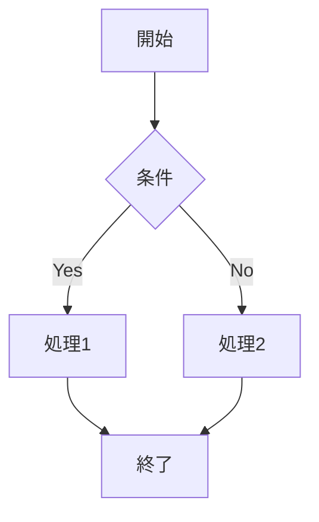

# v1.0.4 新機能テスト

このファイルは、v1.0.4で追加された新機能をテストするためのものです。

## 脚注テスト

これは脚注付きのテキストです[^1]。

別の脚注もあります[^note]。

複数回参照される脚注です[^shared]。同じ脚注を再度参照[^shared]。

## ハイライトテキストテスト

==このテキストはハイライトされるべきです==

通常のテキストと==ハイライトされたテキスト==が混在しています。

## 上付き文字・下付き文字テスト

化学式: H~2~O（水）、CO~2~（二酸化炭素）

数学式: E = mc^2^、x^2^ + y^2^ = r^2^

混在: H~2~SO~4~の濃度は10^-3^ mol/Lです。

## 数式テスト（既存機能）

インライン数式: $E = mc^2$

ディスプレイ数式:
$$\int_{-\infty}^{\infty} e^{-x^2} dx = \sqrt{\pi}$$

## Mermaidテスト（既存機能）

## 脚注の定義

[^1]: これは脚注の内容です。
[^note]: 名前付き脚注の内容です。
[^shared]: 複数回参照される脚注の内容です。

## 期待される結果

- 脚注は番号付きリンクとして表示され、ページ下部に脚注リストが表示される
- ハイライトテキストは黄色い背景で表示される
- 下付き文字は小さく下に表示される
- 上付き文字は小さく上に表示される
- 数式とMermaid図は従来通り正しく表示される
