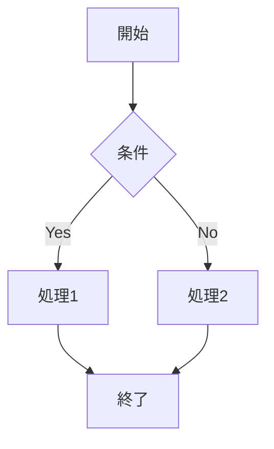

# バージョンテスト

## KaTeX数式テスト

インライン数式: $E = mc^2$

ディスプレイ数式:
$$\int_{-\infty}^{\infty} e^{-x^2} dx = \sqrt{\pi}$$

複雑な数式:
$$\begin{pmatrix}
a & b \\
c & d
\end{pmatrix}
\begin{pmatrix}
x \\
y
\end{pmatrix}
=
\begin{pmatrix}
ax + by \\
cx + dy
\end{pmatrix}$$

## Mermaidダイアグラムテスト

## 更新されたバージョン

- **KaTeX**: v0.16.22 (最新)
- **Mermaid**: v11.12.0 (最新)

これらのライブラリが正常に動作していることを確認するためのテストファイルです。
