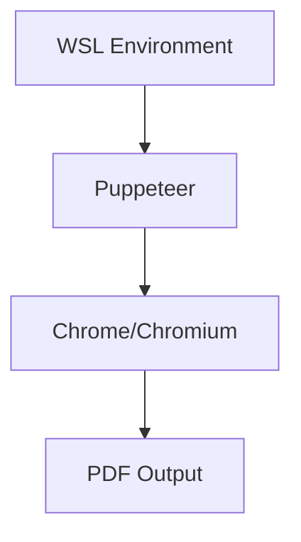

# WSL Test Document

This is a test document to verify PDF conversion works in WSL environment.

## Features to Test

- Basic markdown rendering
- Code blocks
- Lists and formatting

```javascript
console.log('Hello from WSL!');
```

### List Test
1. First item
2. Second item
3. Third item

**Bold text** and *italic text* should render correctly.

## Mermaid Diagram Test



This document tests the WSL-specific fixes for:
- Chrome executable path detection
- Temporary file handling in /tmp
- Enhanced launch options for WSL
